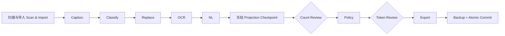

<div align="center">

# Tagger2 Inference Rebuild

**面向 Windows 的本地优先图像打标、视觉模型推理与数据集工作流工作台**

**Local-first image tagging, vision-model inference and dataset workflow workbench for Windows**

[](https://github.com/nzs234/Tagger2_Inference_Rebuild2/releases/latest) [](https://github.com/nzs234/Tagger2_Inference_Rebuild2/actions/workflows/ci.yml)    

[下载最新版 / Download](https://github.com/nzs234/Tagger2_Inference_Rebuild2/releases/latest) · [快速开始 / Quick Start](#quick-start) · [数据集工作流 / Dataset Workflow](#dataset-workflow) · [开发与验证 / Development](#development) · [完整文档 / Docs](#documentation)

> 本文档为**中英双语**：每个章节先中文、后英文。
> This document is **bilingual**: every section is presented in Chinese first, followed by English.

</div>

---

Tagger2 Inference Rebuild 将本地 Caption 模型、在线视觉模型、多供应商图像生成、单图工作台、
批量任务、LSE14 美学评分、视频提示词、事务化数据集处理与本地 e621 标签百科整合在一个 FastAPI + React 应用中。

Tagger2 Inference Rebuild brings local caption models, online vision models, multi-provider image
generation, a single-image workbench, batch jobs, LSE14 aesthetic scoring, video prompts,
transactional dataset processing and a local e621 tag encyclopedia together in one FastAPI + React app.

项目以“本地数据默认留在本机”为基础：只有显式启用在线 Provider 或 NL 阶段时，才会向配置的远程服务发送请求。数据集工作流在真正写入文件前执行预检、人工复核、资源指纹校验和备份，尽量让大规模标注任务可检查、可恢复、可复现。

The project is built on "local data stays local by default": requests only reach configured remote
services when you explicitly enable an online provider or the NL stage. The dataset workflow runs
pre-checks, human review, resource fingerprint verification and backups before it ever writes files,
so large tagging jobs stay inspectable, resumable and reproducible.

> [!IMPORTANT]
> 本仓库是独立重建版本，不会修改原项目。Dataset Workflow 的兼容性基线固定为
> [`lse14/e621-standard-capotion-workflow@ccc9d074`](https://github.com/lse14/e621-standard-capotion-workflow/commit/ccc9d07497be637fc097c5da009d791f017144c9)，严格端口文件由自动化测试校验。
>
> This repository is an independent rebuild and never modifies the original project. The Dataset
> Workflow compatibility baseline is pinned to
> [`lse14/e621-standard-capotion-workflow@ccc9d074`](https://github.com/lse14/e621-standard-capotion-workflow/commit/ccc9d07497be637fc097c5da009d791f017144c9);
> strict port files are verified by automated tests.

<a id="contents"></a>

## 目录 / Table of Contents

- [项目特点 / Highlights](#highlights)
- [功能一览 / Features](#features)
- [快速开始 / Quick Start](#quick-start)
- [模型与 Provider / Models & Providers](#models-and-providers)
- [图像生成 / Image Generation](#image-generation)
- [数据集工作流 / Dataset Workflow](#dataset-workflow)
- [标签管理 / Tag Manager](#tag-manager)
- [Tag Wiki](#tag-wiki)
- [输出格式 / Output Format](#output-format)
- [工作流资源 / Workflow Resources](#workflow-resources)
- [配置与安全 / Configuration & Security](#configuration-and-security)
- [更新项目 / Updating](#updating)
- [开发与验证 / Development & Validation](#development)
- [构建发行包 / Release Build](#release-build)
- [目录结构 / Project Layout](#project-layout)
- [常见问题 / Troubleshooting](#troubleshooting)
- [相关文档 / Documentation](#documentation)

<a id="highlights"></a>

## 项目特点 / Project Highlights

| 能力 | 说明 |
| --- | --- |
| 本地优先 | 图片、模型、任务数据库和产物默认保存在本机；在线调用必须由用户显式配置。 |
| 本地与在线并行 | 工作台和批量任务均支持本地、在线以及本地 + 在线混合模式。 |
| 多供应商图像生成 | 在同一页面使用 Google Nano Banana、OpenAI GPT Image、xAI Grok Image 或兼容 API，并持久化任务与产物。 |
| 事务化工作流 | 数据集先导入到任务工作区，完成校验和人工复核后才进入 Export 与 Commit。 |
| 可复现审阅 | Caption、Classify、Replace、OCR、NL 只生成一次；审阅恢复读取带摘要的不可变 checkpoint。 |
| 原地更新保护 | `in_place` 模式在首次写入前创建并验证 ZIP64 标注备份，支持幂等恢复。 |
| 大任务恢复 | 样本按最多 500 条批量 claim，使用 lease、heartbeat 和 attempt 状态支持中断恢复。 |
| 固定资源 | 分类、替换、Tokenizer、OCR 等资源通过 manifest、大小和 SHA-256 指纹冻结；模型类资源按需自动下载。 |
| 安全边界 | API 使用 `root_id + relative_path`，Provider URL 执行 SSRF/DNS 校验并禁止自动重定向。 |
| 完整质量门禁 | 后端测试、Ruff、mypy、前端测试、ESLint、TypeScript、Vite 和 Playwright 由 CI 持续验证。 |

| Capability | Description |
| --- | --- |
| Local-first | Images, models, job databases and artifacts stay on the machine by default; online calls require explicit user configuration. |
| Local & online in parallel | The workbench and batch jobs support local, online and hybrid local + online modes. |
| Multi-provider image generation | Use Google Nano Banana, OpenAI GPT Image, xAI Grok Image or compatible APIs on one page, with persisted jobs and artifacts. |
| Transactional workflow | Datasets are imported into a job workspace first; Export and Commit only run after validation and human review. |
| Reproducible review | Caption, Classify, Replace, OCR and NL are generated exactly once; review recovery reads immutable, digested checkpoints. |
| In-place update protection | `in_place` mode creates and verifies a ZIP64 annotation backup before the first write, with idempotent restore. |
| Large-job recovery | Samples are claimed in batches of up to 500 with leases, heartbeats and attempt states for interruption recovery. |
| Pinned resources | Classification, replacement, tokenizer and OCR resources are frozen by manifest, size and SHA-256 fingerprints; model-class resources download on demand. |
| Security boundaries | File APIs use `root_id + relative_path`; provider URLs get SSRF/DNS validation and never follow redirects automatically. |
| Full quality gates | Backend tests, Ruff, mypy, frontend tests, ESLint, TypeScript, Vite and Playwright are continuously verified by CI. |

<a id="features"></a>

## 功能一览 / Features

应用启动后默认监听 [`http://127.0.0.1:20000`](http://127.0.0.1:20000)。左侧导航包含以下功能：

The app listens on [`http://127.0.0.1:20000`](http://127.0.0.1:20000) by default. The left navigation exposes:

| 页面 / Page | 主要用途 / Purpose |
| --- | --- |
| 工作台 / Workbench | 拖入单张或少量图片，独立启用本地和在线通道，查看标签、NL、JSON 与美学评分。 / Drop in one or a few images, enable local and online channels independently, and inspect tags, NL, JSON and aesthetic scores. |
| 图像生成 / Image Generation | 统一使用 Grok、Nano Banana 与 GPT Image 系列，设置模型专属参数，管理参考图、进度、结果与历史。 / Use Grok, Nano Banana and GPT Image families in one place with model-specific parameters plus reference images, progress, results and history. |
| 视频提示词 / Video Prompts | 根据图片和补充信息生成图生视频提示词，并管理提示词编辑结果。 / Generate image-to-video prompts from an image plus notes, and manage prompt edits. |
| 批量任务 / Batch Jobs | 扫描本机目录，创建持久化的本地、在线或混合打标任务，查看进度和历史。 / Scan local folders and create persistent local, online or hybrid tagging jobs with progress and history. |
| 数据集工作流 / Dataset Workflow | 执行 Caption、分类、标签替换、OCR、NL、人工复核、Policy、Token 检查与安全提交。 / Run Caption, classification, tag replacement, OCR, NL, human review, Policy, token checks and safe commit. |
| 标签管理 / Tag Manager | 类 BooruDatasetTagManager 的数据集标签编辑：网格浏览、逐图/批量编辑、e621 与 danbooru 标签库自动补全、中英双语标签、下划线/空格切换、NL 在线翻译、撤销重做。 / BooruDatasetTagManager-style dataset tag editing: grid browsing, per-image and bulk edits, e621/danbooru tag autocomplete, bilingual tags, underscore/space switching, online NL translation, undo/redo. |
| Tag Wiki | 本地 e621 标签百科镜像：查含义、中文自然语言语义搜索（跨语言向量 + 关键词融合）、AI 问答（RAG），以及高频标签的结构化中文摘要预翻译。 / Local e621 wiki mirror: meaning lookup, Chinese natural-language semantic search (cross-lingual vector + keyword fusion), RAG-powered AI Q&A, and pre-translated structured Chinese summaries for popular tags. |
| 在线模型 / Online Models | 管理 OpenAI、Gemini、Claude 和兼容 API，测试连接并发现可用模型。 / Manage OpenAI, Gemini, Claude and compatible APIs, test connections and discover models. |
| 本地模型 / Local Models | 下载、注册、加载和卸载模型，管理推理后端、Adapter、阈值与显存驻留。 / Download, register, load and unload models; manage backends, adapters, thresholds and VRAM residency. |
| 设置 / Settings | 管理输入/输出根目录、运行限制和非敏感运行配置。 / Manage input/output roots, run limits and non-sensitive runtime configuration. |

支持的本地推理资产包括 ONNX、PyTorch 和 safetensors 模型。具体是否能自动识别，取决于模型目录内的权重、预处理配置和标签元数据是否完整。

Supported local inference assets include ONNX, PyTorch and safetensors models. Whether a model is
auto-detected depends on how complete its weights, preprocessing configs and label metadata are.

<a id="quick-start"></a>

## 快速开始 / Quick Start

### 方式一：使用发行包（推荐） / Option 1: Release package (recommended)

适合希望直接使用程序、不参与源码开发的用户。

For users who just want to run the program without touching source code.

1. 打开 [GitHub Releases](https://github.com/nzs234/Tagger2_Inference_Rebuild2/releases/latest)。
2. 下载最新的 `Tagger2_Inference_Rebuild_V*.zip` 和对应的 `.sha256.txt`。
3. 将 ZIP 完整解压到普通可写目录，不要直接在压缩包中运行。
4. 首次运行双击 `setup.bat`。
5. 等待便携 Python 和锁定依赖安装完成，浏览器访问 `http://127.0.0.1:20000`。
6. 以后启动只需双击 `start.bat`。

1. Open [GitHub Releases](https://github.com/nzs234/Tagger2_Inference_Rebuild2/releases/latest).
2. Download the latest `Tagger2_Inference_Rebuild_V*.zip` and its `.sha256.txt`.
3. Extract the ZIP fully into a normal writable directory; do not run from inside the archive.
4. Double-click `setup.bat` on first run.
5. Wait for the portable Python and locked dependencies to install, then open `http://127.0.0.1:20000`.
6. From then on, just double-click `start.bat`.

发行包内置基础 Python 3.12 运行时和已经构建的前端，不要求目标电脑预装 Python 或 Node.js。首次安装机器学习依赖需要联网，下载量可能达到数 GB。**模型类资源一律不随包**（嵌入模型、数据集分类快照、Tokenizer 等）：在首次使用时自动下载并校验 SHA-256 指纹；也可以提前运行 `runtime\python.exe scripts\fetch_workflow_resources.py` 预取数据集资源。

The package bundles a base Python 3.12 runtime and the built frontend; no preinstalled Python or
Node.js is required. Installing the ML dependencies on first run needs internet and can download
several GB. **Model-class resources never ship in the package** (embedding models, dataset
classification snapshots, tokenizer packs): they download automatically on first use and are verified
against their SHA-256 fingerprints. Dataset resources can also be pre-fetched with
`runtime\python.exe scripts\fetch_workflow_resources.py`.

V1.04.1 起，`setup.bat` 会检查 pip 是否真正可用，并在基础运行时中自动执行随包附带的 pip 引导；`start.bat` 也提供相同兜底。首次部署不需要手动安装 pip。

Since V1.04.1, `setup.bat` verifies that pip actually works and bootstraps pip inside the base
runtime using the bundled guide; `start.bat` applies the same fallback. No manual pip installation
is needed for a first deployment.

> [!TIP]
> `start.bat` 会通过 `nvidia-smi` 自动选择 CUDA 或 CPU 依赖。需要强制使用 CPU 时，可先在命令提示符中执行：
>
> ```bat
> set TAGGER2_TORCH_VARIANT=cpu
> setup.bat
> ```
>
> `start.bat` auto-selects CUDA or CPU dependencies via `nvidia-smi`. To force CPU, run the commands
> above in a command prompt first (`TAGGER2_TORCH_VARIANT=cpu` then `setup.bat`).

### 方式二：从源码运行 / Option 2: Run from source

适合开发者。需要 Git、Python 3.12 和 Node.js 22。

For developers. Requires Git, Python 3.12 and Node.js 22.

```powershell
git clone https://github.com/nzs234/Tagger2_Inference_Rebuild2.git
cd Tagger2_Inference_Rebuild2

py -3.12 -m venv .venv
.\.venv\Scripts\python.exe -m pip install --require-hashes -r requirements-gpu.lock
# CPU 机器将上一行的 requirements-gpu.lock 改为 requirements-cpu.lock
# On CPU machines switch requirements-gpu.lock above to requirements-cpu.lock

cd frontend
npm ci
npm run build
cd ..

$env:PYTHONPATH = "$PWD\backend"
.\.venv\Scripts\python.exe -m tagger2.main
```

### 完成第一个打标任务 / Your first tagging job

1. 打开“本地模型”，下载或注册至少一个 Caption 模型。
2. 加载模型，并确认页面显示模型已驻留。
3. 回到“工作台”，拖入图片。
4. 启用“本地模型”，选择需要参与推理的模型。
5. 按模型预设使用阈值，或只为本次任务调整分类阈值。
6. 提交任务，结果会按本地与在线通道分别显示。

1. Open "Local Models" and download or register at least one caption model.
2. Load the model and confirm the page reports it as resident.
3. Return to the "Workbench" and drop in images.
4. Enable "Local Models" and pick the models to run.
5. Use the model's preset thresholds or adjust per-category thresholds for this run only.
6. Submit the job; results are shown per local and online channel.

要处理完整数据集，请继续阅读[数据集工作流](#dataset-workflow)。

To process a full dataset, continue with the [Dataset Workflow](#dataset-workflow) section.

<a id="models-and-providers"></a>

## 模型与 Provider / Models & Providers

### 本地模型 / Local models

- 可在“本地模型”页面输入 Hugging Face 仓库地址下载模型。
- 也可以将已有模型完整复制到 `models/`，再刷新模型注册表。
- 模型 Profile 可保存后端类型、输入尺寸、全局阈值、分类阈值和 Adapter 配置。
- 默认最多同时驻留两个模型，可通过配置调整；显存不足时应主动卸载不用的模型。
- 首次加载 LSE14 美学评分器时，可能需要下载固定的 SigLIP、CLIP 与 `1k.safetensors` 资产。

- Download models on the "Local Models" page by entering a Hugging Face repo id.
- Or copy existing models fully into `models/` and refresh the model registry.
- Model profiles persist backend type, input size, global thresholds, per-category thresholds and adapter settings.
- At most two models are resident by default (configurable); unload unused models when VRAM runs low.
- Loading the LSE14 aesthetic scorer for the first time may download pinned SigLIP, CLIP and `1k.safetensors` assets.

LSE14 输出包括 1-5 分总体评分与分桶、构图、色彩、敏感内容评分和域内概率。模型缓存位于 `data_cache/huggingface`，权重位于 `models`；需要 Hugging Face 身份验证时，请通过进程环境变量 `HF_TOKEN` 提供令牌。

LSE14 outputs a 1–5 overall score plus buckets for composition, color, sensitivity ratings and
in-domain probability. Model caches live in `data_cache/huggingface` and weights in `models`; when
Hugging Face authentication is needed, provide a token via the process environment variable `HF_TOKEN`.

### 在线 Provider / Online providers

界面内置以下连接预设：

The UI ships these connection presets:

- OpenAI 官方 API / Official OpenAI API
- xAI / Grok 官方 API / Official xAI / Grok API
- Gemini 官方 API / Official Gemini API
- Claude 官方 API / Official Claude API
- OpenAI / NewAPI 兼容接口 / OpenAI / NewAPI-compatible endpoints
- Gemini `generateContent` 兼容接口 / Gemini `generateContent`-compatible endpoints
- Claude Messages 兼容接口 / Claude Messages-compatible endpoints
- 兼容旧配置的 LM Studio 与 Antigravity Provider / LM Studio and Antigravity providers compatible with legacy configs

API Key 不写入 TOML。Windows 默认通过 Credential Manager 对应的 keyring 后端保存；API 响应只暴露“是否已配置”和末尾字符等非敏感元数据。

API keys are never written to TOML. On Windows they are stored via the Credential Manager keyring
backend; API responses only expose non-sensitive metadata such as "configured or not" and trailing
characters.

> [!WARNING]
> 启用在线模型、NL 图片输入或远程兼容接口意味着图片或业务 JSON 可能被发送给相应 Provider。请先确认数据授权范围、服务条款和隐私要求。
>
> Enabling online models, NL image input or remote-compatible endpoints means images or business
> JSON may be sent to the corresponding provider. Confirm data authorization, terms of service and
> privacy requirements first.

<a id="image-generation"></a>

## 图像生成 / Image Generation

V1.04 将原先独立图像工具的核心工作流重建为 Tagger2 原生页面。它复用“在线模型”中的 Provider、密钥存储与模型发现能力，但使用独立的持久任务数据库和产物目录。旧工具中的明文配置、历史记录和临时文件不会被自动读取或迁移。

V1.04 rebuilt the core workflow of the former standalone image tool as a native Tagger2 page. It
reuses providers, key storage and model discovery from "Online Models", but uses its own persistent
job database and artifact directory. Plaintext configs, history and temp files from the old tool are
not read or migrated automatically.

### 支持的模型族与路由 / Supported model families and routing

| 模型族 / Family | 自动识别示例 / Auto-detected examples | 可用请求风格 / Request styles | 主要参数 / Key parameters |
| --- | --- | --- | --- |
| Google Gemini / Nano Banana | `gemini-3-pro-image`、`gemini-3.1-flash-image`、`gemini-3.1-flash-lite-image`、`gemini-2.5-flash-image` | Gemini native `generateContent`；OpenAI-compatible chat/images | 比例、图像尺寸、参考图、TEXT + IMAGE、System instruction、Temperature、Top P、Top K、并行或 Candidate count / aspect ratio, image size, reference images, TEXT + IMAGE, system instruction, temperature, top-p, top-k, parallel requests or candidate count |
| OpenAI GPT Image | 所有 `gpt-image*` 模型 ID / all `gpt-image*` model ids | Images generations / edits；兼容 chat / compatible chat | 画布尺寸、质量、背景、输出格式、压缩、审核级别、输入保真度 / canvas size, quality, background, output format, compression, moderation, input fidelity |
| xAI Grok Image | `grok-2-image-1212`；其他 Grok 图像模型可显式选择能力族 / other Grok image models can select the family explicitly | Images generations / edits；兼容 chat / compatible chat | 通用数量/响应格式；兼容线路可按能力启用比例、尺寸和质量 / generic count/response format; compatible routes can enable ratio, size and quality per capability |
| 保守兼容模式 / Conservative compatibility | 未登记的新模型或私有网关模型 / unlisted or private-gateway models | OpenAI images 或 chat / OpenAI images or chat | 默认只发送 `model`、`prompt`、`n` 和响应格式等通用字段 / only generic fields such as `model`, `prompt`, `n` and response format by default |

模型实际是否可用、账户是否有访问权限以及服务端允许的数量仍由 Provider 决定。能力注册表有版本和核验日期；未知模型不会自动收到供应商专属参数。若兼容网关明确支持某一模型族，可在 Provider 设置中显式选择能力族与请求风格。

Actual availability, account access and server-side count limits remain provider decisions. The
capability registry is versioned with verification dates; unknown models never receive
vendor-specific parameters automatically. If a compatible gateway explicitly supports a family,
select that capability family and request style in the provider settings.

Gemini 模型显式选择 OpenAI-compatible Chat/Images 风格时，会同时发送兼容工具常用的 `generation_config` 与 `extra_body.google` 图像扩展；native 风格只发送官方 `generationConfig.imageConfig`。这些扩展不会自动发送给未知模型或其他模型族。

When a Gemini model is explicitly set to the OpenAI-compatible Chat/Images style, both the
`generation_config` used by compatible tools and the `extra_body.google` image extension are sent;
the native style only sends the official `generationConfig.imageConfig`. These extensions are never
sent automatically to unknown models or other families.

### 配置 Provider / Configuring a provider

1. 打开“在线模型”，新建 OpenAI、xAI、Gemini 或“自定义 API” Provider。
2. 填写文本/通用 Base URL 和主模型；图像服务使用不同域名时，单独填写“图像 Base URL”。
3. 打开“启用图像生成”。自动识别不准确时，选择 Gemini / Nano Banana、GPT Image 或 Grok Image 能力族。
4. 请求风格选择“自动”，或按网关文档指定 Gemini native、Images generation/edit、Chat completions。
5. 保存后写入 API Key。密钥保存在系统 Credential Manager，不会进入任务 JSON、SQLite 公共字段或浏览器 URL。

1. Open "Online Models" and create an OpenAI, xAI, Gemini or "Custom API" provider.
2. Fill in the text/general base URL and main model; if the image service uses another domain, fill the "Image Base URL" separately.
3. Toggle "Enable image generation". If auto-detection is inaccurate, pick the Gemini / Nano Banana, GPT Image or Grok Image family.
4. Leave the request style on "Auto", or specify Gemini native, Images generation/edit or Chat completions per the gateway docs.
5. Save, then enter the API key. Keys live in the system Credential Manager — never in job JSON, public SQLite fields or browser URLs.

### 创建与管理任务 / Creating and managing jobs

1. 打开“图像生成”，选择 Provider 和模型；模型输入框会复用现有模型发现 API。
2. 选择文生图或图像编辑，填写提示词；编辑模式至少需要一张参考图。
3. 设置数量与当前模型公开的参数。高级区域只显示该能力族和请求风格支持的字段。
4. 提交后可离开页面。任务、attempt、事件、参考图副本和结果均已持久化，刷新页面仍可继续查看。
5. 失败、部分成功或取消的任务可重试；删除历史会同时删除对应参考图副本和生成产物，并要求二次确认。

1. Open "Image Generation", pick a provider and model; the model field reuses the existing model discovery API.
2. Choose text-to-image or image editing and write the prompt; editing requires at least one reference image.
3. Set the count and the parameters the model exposes. The advanced area only shows fields supported by the selected family and style.
4. Leave the page after submitting: jobs, attempts, events, reference-image copies and results are all persisted and survive page refreshes.
5. Failed, partially successful or cancelled jobs can be retried; deleting history also deletes the corresponding reference copies and artifacts and asks for confirmation.

多图的“并行请求”会按 Provider 并发上限运行独立 attempt；Gemini 支持时也可使用单次请求的 Candidate count。应用退出时，正在执行的 attempt 会回到可恢复状态；已完整写入并通过 SHA-256 校验的产物不会再次调用 Provider。

Multi-image "parallel requests" run independent attempts within the provider concurrency limit; when
Gemini supports it, a single request's candidate count can be used instead. On app exit, running
attempts return to a resumable state; artifacts already fully written and SHA-256 verified are never
requested from the provider again.

### 数据与安全边界 / Data and security boundaries

- 独立数据库 / Separate database: `data/image_generation/image_generation.sqlite3`
- 任务工作区 / Job workspaces: `data/image_generation/jobs/<job_id>/`
- 每个任务冻结非敏感 Provider 快照、能力快照和配置 hash；执行前必须再次核对摘要。 / Each job freezes a non-sensitive provider snapshot, capability snapshot and config hash; the digest must be re-verified before execution.
- 参考图和产物保存相对路径、尺寸、MIME 与 SHA-256；内容被修改后下载和恢复都会 fail closed。 / Reference images and artifacts store relative paths, dimensions, MIME and SHA-256; tampered content fails closed on download and restore.
- Provider JSON 响应、Base64 图像和远程图片下载均有字节/像素/边长上限，不依赖 `Content-Length` 才生效。 / Provider JSON responses, base64 images and remote image downloads carry byte/pixel/edge limits that apply even without `Content-Length`.
- Provider 与产物 URL 禁止自动重定向，并在配置和请求阶段执行 DNS/SSRF 检查。 / Provider and artifact URLs never follow redirects automatically and get DNS/SSRF checks at configuration and request time.
- 局域网模式下，图片预览和下载同样通过 Bearer Token 请求，不把令牌写入图片 URL。 / In LAN mode, image previews and downloads also use Bearer tokens instead of embedding tokens in image URLs.

<a id="dataset-workflow"></a>

## 数据集工作流 / Dataset Workflow

Dataset Workflow 面向需要批量整理现有标注、生成标准九字段数据、进行人工复核并安全写回的数据集任务。

Dataset Workflow targets dataset jobs that need to bulk-reorganize existing annotations, produce
standard nine-field data, run human review and write results back safely.



### 阶段说明 / Stages

| 阶段 / Stage | 作用 / Purpose | 默认行为 / Default |
| --- | --- | --- |
| Scan / Import | 扫描图片和现有 TXT/JSON，识别裸图、标签 TXT、NL TXT、标准 JSON 与 raw e621 JSON。 / Scans images and existing TXT/JSON, recognizing bare images, tag TXT, NL TXT, standard JSON and raw e621 JSON. | 始终执行 / always runs |
| Caption | 调用已加载的本地模型生成标签。 / Calls loaded local models to produce tags. | 对需要补充标签的样本启用 / enabled for samples that need tags |
| Classify | 使用冻结的 e621/Danbooru 快照，将标签整理到标准字段。 / Sorts tags into standard fields using frozen e621/Danbooru snapshots. | e621 配置启用 / enabled in the e621 config |
| Replace | 按不可变索引执行 keep / replace / drop 规则。 / Applies keep/replace/drop rules from immutable indexes. | 使用 `replace-e621-pass-drop-v2` / uses `replace-e621-pass-drop-v2` |
| OCR | 通过隔离的 PaddleOCR CPU 运行时识别画面文字。 / Recognizes on-screen text via an isolated PaddleOCR CPU runtime. | 可选，默认关闭 / optional, off by default |
| NL | 复用原始 NL 或通过选定 Provider 生成自然语言描述。 / Reuses existing NL or generates descriptions via the selected provider. | UI 中需显式配置远程生成 / remote generation must be explicitly configured in the UI |
| Count Review | 对 `solo`、`duo`、`trio`、`group` 等数量结果进行人工确认。 / Human confirmation of count results such as `solo`, `duo`, `trio`, `group`. | 可选 / optional |
| Policy | 按稳定 seed 执行 artist/quality dropout 和 appearance/NL 联动策略。 / Runs artist/quality dropout and appearance/NL policies with stable seeds. | 默认关闭 / off by default |
| Token Budget | 使用冻结 Tokenizer 检查超长文本，并允许人工修改 NL。 / Checks overlong text with a frozen tokenizer and allows manual NL edits. | 可选阈值，资源按需下载 / optional threshold; resource downloads on demand |
| Export / Commit | 生成 JSON、TXT 或两者，并在校验通过后写入目标数据集。 / Produces JSON, TXT or both and writes to the target dataset after checks pass. | 最终阶段 / final stage |

### 审阅结果不会被重新生成 / Review results are never regenerated

在进入 Count Review 前，系统将 Caption、Classify、Replace、OCR 和 NL 的完整 projection 写入任务专属的不可变 checkpoint。checkpoint 包含：

Before Count Review, the full projection of Caption, Classify, Replace, OCR and NL is written to a
job-specific immutable checkpoint. The checkpoint contains:

- schema 版本与 stage cursor / schema version and stage cursor
- 任务配置 hash / job config hash
- 资源与模型 fingerprints / resource and model fingerprints
- 样本 manifest / sample manifest
- projection 内容摘要 digest / digest of the projection content

Count Review 确认后只叠加人工 count，再执行 Policy；Token Review 确认后只叠加人工 NL 修改，再继续 Token Budget、Export 和 Commit。checkpoint 缺失、内容被修改、配置变化或资源指纹不一致时，任务会 fail closed，不会静默重新调用模型或远程 Provider。

After Count Review confirmation only the human counts are layered on before Policy runs; after
Token Review only human NL edits are layered on before Token Budget, Export and Commit continue. If
the checkpoint is missing, tampered with, or the config or resource fingerprints changed, the job
fails closed — models and remote providers are never silently re-invoked.

### 写入模式 / Write modes

| 模式 / Mode | 行为 / Behavior | 适用场景 / Use case |
| --- | --- | --- |
| `full_copy` | 将图片和新标注复制到独立输出目录，源数据保持不变。 / Copies images and new annotations into a separate output directory; sources stay untouched. | 首次使用、验证配置、保留原始数据 / first runs, validating configs, keeping originals |
| `in_place` | 在原数据集旁更新标注；首次写入前生成并验证 ZIP64 备份。 / Updates annotations next to the original dataset; a ZIP64 backup is created and verified before the first write. | 已确认流程和结果的大规模更新 / large-scale updates after the flow and results are confirmed |

建议先用小样本和 `full_copy` 验证结果，再对正式数据使用 `in_place`。

Validate with a small sample and `full_copy` first, then apply `in_place` to production data.

### 生命周期与恢复 / Lifecycle and recovery

- 任务支持显式开始、暂停、恢复、取消、修复、恢复备份和丢弃。 / Jobs support explicit start, pause, resume, cancel, repair, backup restore and discard.
- 执行进度、事件、issue、资源快照和 commit journal 持久化到独立 SQLite 数据库。 / Progress, events, issues, resource snapshots and the commit journal persist to a separate SQLite database.
- worker 按最多 500 个样本领取 lease，并周期性 heartbeat；进程重启后可跳过已完成样本。 / Workers claim leases of up to 500 samples with periodic heartbeats; finished samples are skipped after restarts.
- Restore 请求具备幂等记录，重复请求不会再次覆盖用户后续修改。 / Restore requests are idempotent; repeats never overwrite later user edits.
- Discard 进入独立终态并释放数据集锁，不再暴露恢复操作。 / Discard is a separate terminal state that releases the dataset lock and hides restore.
- 事件同时支持带 cursor、heartbeat 与 `Last-Event-ID` 的 SSE，以及 JSON polling fallback。 / Events stream via SSE with cursor, heartbeat and `Last-Event-ID`, with a JSON polling fallback.

<a id="tag-manager"></a>

## 标签管理 / Tag Manager

类似 BooruDatasetTagManager 的数据集标签编辑工作台，面向“人工修标注”的交互场景，与数据集工作流共享九字段契约、标签库资源与路径安全原语。完整说明见 [docs/tag_manager.md](docs/tag_manager.md)。

A BooruDatasetTagManager-like dataset tag editing workbench for hands-on annotation fixing, sharing
the nine-field contract, tag-database resources and path-safety primitives with the dataset
workflow. Full details in [docs/tag_manager.md](docs/tag_manager.md).

- **数据集会话 / Sessions**：选择输入根目录与相对路径打开数据集，后台扫描图片与标注并建立索引，支持递归、mtime 增量刷新与多会话。 / Open a dataset by input root + relative path; a background scan indexes images and annotations with recursion, mtime-based incremental refresh and multiple sessions.
- **网格浏览 / Grid browsing**：缩略图网格按文件名/修改时间/标签数排序，按标签组合（包含 all/any、排除）、标注格式与有无 sidecar 过滤。 / Thumbnail grid sortable by name/mtime/tag count and filterable by tag combinations (all/any, excluded), annotation format and sidecar presence.
- **三种可编辑格式 / Three editable formats**：booru 平面 TXT、本地标签 JSON（保留 category/score 元数据）、九字段 Anima JSON（分字段表单，九字段顺序冻结）。raw e621 分组 JSON 只读展示。 / Flat booru TXT, local tag JSON (keeping category/score metadata) and nine-field Anima JSON (field forms, frozen field order). Raw e621 group JSON is read-only.
- **标签库自动补全 / Tag autocomplete**：e621 与 danbooru 快照均随发布包注册，补全返回分类、post_count 与别名指向；如需自建可用 `scripts/import_classification_snapshot.py --profile danbooru` 导入。 / Both e621 and danbooru snapshots register with the package; completions return category, post_count and alias targets. Build your own via `scripts/import_classification_snapshot.py --profile danbooru`.
- **中英双语显示 / Bilingual display**：标签同时显示英文原名与中文译名，词库（Danbooru 31 万条 / e621 6.8 万条）随仓库离线提供，可一键关闭；缺失词库时自动退回纯英文。 / Tags show the English name and Chinese translation side by side; dictionaries (Danbooru ~310k / e621 ~68k entries) ship offline with the repo and can be toggled off. Missing dictionaries fall back to English-only.
- **下划线 / 空格切换 / Underscore/space switch**：一个开关同时控制显示与保存写入的分隔符风格；过滤按归一化键比较，两种拼写互通。 / One toggle controls both display and saved separator style; filters compare normalized keys so both spellings match.
- **NL 在线翻译 / Online NL translation**：九字段的 `nl` 段落可用已配置的在线大模型中↔英翻译，结果需显式「替换 NL」才写入草稿。 / The nine-field `nl` text can be translated Chinese↔English via a configured online model; results only enter the draft after an explicit "Replace NL".
- **缺失标签在线翻译 / On-demand tag translation**：词库缺失的标签可发给在线模型批量翻译，结果持久化到用户词典，重启后离线可用。 / Tags missing from the dictionary can be batch-translated by the online model; results persist to a user dictionary and resolve offline after restarts.
- **批量操作 / Bulk operations**：多选或按过滤器圈定后 批量添加/删除/替换（支持正则）；九字段仅作用于 tags/appearance/environment 三个列表字段。 / Multi-select or filter-scoped bulk add/remove/replace (regex supported); nine-field mode only touches the tags/appearance/environment list fields.
- **撤销/重做 / Undo & redo**：每会话保留最近 20 步操作日志；所有写回为原子写并带 mtime 乐观锁。 / Each session keeps the last 20 operations; all write-backs are atomic with mtime optimistic locking.
- **标签统计 / Tag statistics**：频次排行（带分类着色），点击即加入过滤。 / Frequency ranking with category coloring; click to add a filter.
- **缩略图 / Thumbnails**：服务端按需生成并磁盘缓存，解码前执行字节与像素预算校验。 / Generated server-side on demand with disk caching; byte and pixel budgets are checked before decode.

<a id="tag-wiki"></a>

## Tag Wiki

本地化的 e621 标签百科与智能检索，解决“这个 tag 是什么意思”“我想表达某个动作用什么 tag”“这个 tag 要和什么搭配”三个问题。完整说明见 [docs/tag_wiki.md](docs/tag_wiki.md)。

A localized e621 tag encyclopedia with intelligent retrieval, answering three questions: "what does
this tag mean", "which tag expresses the action I want" and "what should this tag be paired with".
Full details in [docs/tag_wiki.md](docs/tag_wiki.md).

- **本地数据 / Local data**：wiki 正文来自 e621 官方 `db_export` 的 `wiki_pages` 每日导出（约 17 MB），应用内一键下载、解析 DText 并增量入库到 `data/tag_wiki/tag_wiki.sqlite3`；tag 类别、post_count、别名与 implications 复用分类快照资源。 / Wiki bodies come from the official e621 `db_export` `wiki_pages` daily dump (~17 MB), downloaded in one click, parsed from DText and imported incrementally into `data/tag_wiki/tag_wiki.sqlite3`. Tag categories, post counts, aliases and implications reuse the classification snapshot resource.
- **三种查询模式 / Three query modes**：
  - **查含义 / Lookup**：tag → 别名归一 → 中文摘要 + 英文原文 + implications 搭配提示 + 相关 tag。 / tag → alias normalization → Chinese summary + English body + implication hints + related tags.
  - **语义搜索 / Semantic search**：中文/自然语言描述 → multilingual-e5 跨语言向量检索与 FTS5 关键词检索做 RRF 融合，返回相关 tag 与 wiki 依据；画师/角色/贡献者类链接列表页与"链接汤"章节在构建时剪枝，避免污染排序。 / Chinese/natural-language queries hit the English corpus via multilingual-e5 cross-lingual vectors fused with FTS5 keywords (RRF), returning tags with wiki evidence. Link-list pages (artist/character/contributor) and "link soup" chunks are pruned at build time so rankings stay clean.
  - **AI 问答 / AI Q&A**：本地检索提供上下文，已配置的在线大模型生成带来源的中文回答（RAG），无可用 Provider 时给出引导。 / Local retrieval supplies context and a configured online model produces grounded, source-cited Chinese answers (RAG); without a provider the UI shows setup guidance.
- **中文摘要预翻译 / Chinese summary pre-translation**：为高频 tag（默认 post_count ≥ 1000，可切换模型词表/全部）批量生成结构化摘要（含义/用法/搭配/注意事项），支持在线 Provider 或本地 GPU LLM 两条路径，断点续跑。 / Structured summaries (meaning/usage/pairing/notes) are batch-generated for popular tags (default post_count ≥ 1000; switchable to model vocabulary or all), via online providers or a local GPU LLM, fully resumable.
- **快捷入口 / Quick entries**：标签管理器与工作台的标签药丸上有“查 Wiki”按钮，弹出抽屉直接查看该标签的中文释义与搭配。 / Tag pills in the tag manager and workbench carry a "Wiki" button opening a drawer with the Chinese meaning and pairings.
- **命令行运维 / CLI operations**：`scripts/build_tag_wiki.py --build/--translate` 与 `scripts/translate_tag_wiki_local.py`（本地 LLM 翻译）支持不开浏览器完成构建、更新与翻译，全部断点续跑。 / `scripts/build_tag_wiki.py --build/--translate` and `scripts/translate_tag_wiki_local.py` (local LLM translation) handle build, update and translation headlessly, all resumable.
- **离线友好 / Offline-friendly**：除 AI 问答与摘要生成外，查询、检索与已有摘要展示全部离线可用。 / Apart from AI Q&A and summary generation, lookup, search and summary viewing all work offline.

<a id="output-format"></a>

## 输出格式 / Output Format

工作流最终 JSON 严格包含九个字段，并保持固定顺序：

The workflow's final JSON contains exactly nine fields in a fixed order:

| 字段 / Field | 类型 / Type | 含义 / Meaning |
| --- | --- | --- |
| `quality` | `string[]` | 质量或评级标签 / quality or rating tags |
| `count` | `string` | `""`、`solo`、`duo`、`trio` 或 `group` / `""`, `solo`, `duo`, `trio` or `group` |
| `character` | `string` | 角色名 / character name |
| `series` | `string` | 系列或作品名 / series or work name |
| `artist` | `string` | 作者名 / artist name |
| `appearance` | `string[]` | 外观特征 / appearance traits |
| `tags` | `string[]` | 通用标签 / general tags |
| `environment` | `string[]` | 环境与场景标签 / environment and scene tags |
| `nl` | `string` | 自然语言描述 / natural-language description |

```json
{
  "quality": ["high_quality"],
  "count": "solo",
  "character": "example_character",
  "series": "example_series",
  "artist": "example_artist",
  "appearance": ["blue_eyes", "long_hair"],
  "tags": ["looking_at_viewer", "smile"],
  "environment": ["outdoors", "forest"],
  "nl": "A character with long hair is smiling in a forest."
}
```

TXT 输出使用与固定上游兼容的 flat caption 规则：跨字段去重、下划线转空格、括号转义，并以句点结束。

TXT output follows the flat caption rules compatible with the pinned upstream: cross-field
deduplication, underscores to spaces, escaped brackets, terminated with a period.

<a id="workflow-resources"></a>

## 工作流资源 / Workflow Resources

每个资源由 manifest（resource_id、category、SHA-256 指纹、大小、来源）定义，内容寻址文件存放在
`data/workflows/resources/<category>/<resource_id>.<fingerprint前16位>`。自 V1.10 起，发行包只包含
manifest 与小型数据表；**模型类大文件（分类快照、Tokenizer）在首次使用时自动下载**，下载后按指纹
校验再投入使用。也可以用 `runtime\python.exe scripts\fetch_workflow_resources.py` 预取，或把文件
手动放入对应目录以支持完全离线部署。托管位置固定在
[resources-v1 发行页](https://github.com/nzs234/Tagger2_Inference_Rebuild2/releases/tag/resources-v1)。

Each resource is defined by a manifest (resource_id, category, SHA-256 fingerprint, size, source);
content-addressed files live at
`data/workflows/resources/<category>/<resource_id>.<fingerprint16>`. Since V1.10 the release package
only carries manifests and small data tables; **model-class blobs (classification snapshots, the
tokenizer pack) download automatically on first use**, verified against the fingerprint before any
consumer touches them. Pre-fetch with `runtime\python.exe scripts\fetch_workflow_resources.py`, or
drop the files into place manually for fully offline deployments. The hosting location is pinned to
the [resources-v1 release](https://github.com/nzs234/Tagger2_Inference_Rebuild2/releases/tag/resources-v1).

| 类别 / Category | Resource ID | 分发方式 / Distribution | SHA-256 |
| --- | --- | --- | --- |
| 分类快照 / Classification snapshot (e621) | `classify-e621-20260812-v1` | 按需下载 / on-demand download | `eccfdfacf3bcf1611a9ee3561f54bb81e946122f582f1f421c5e90689f2db49f` |
| 分类快照 / Classification snapshot (danbooru) | `classify-danbooru-20260902-v1` | 按需下载 / on-demand download | 见 manifest / see manifest |
| 推荐替换索引 / Replacement index | `replace-e621-pass-drop-v2` | 随包 / in package | `2e3c4af6cc93b7f2cc8e55e2eda024ee69942f08a3618b6c2f0dfe6d45991972` |
| Tokenizer | `tokenizer-qwen3-0-6b-tokenizer-v1` | 按需下载 / on-demand download | `aeb13307a71acd8fe81861d94ad54ab689df773318809eed3cbe794b4492dae4` |

推荐替换索引统计 / Replacement index stats: 47,095 keep、3,171 replace、105,440 drop、0 pass。上游 `anthro` 到 `furry` 的随机规则保持原算法不变，调用方通过 `job_id + sample_id + relative_path` 注入任务内稳定随机值，保证同一任务恢复审阅时结果不漂移。

The upstream randomized `anthro` → `furry` rule keeps its original algorithm; callers inject
job-stable randomness via `job_id + sample_id + relative_path`, so review recovery never drifts.

以下内容不会包含在 Git 仓库或基础发行包中 / Never included in the Git repo or the base package:

- Caption 模型权重与 Adapter / Caption model weights and adapters
- Hugging Face 模型缓存 / Hugging Face model caches
- `runtime_ocr/` 和 PaddleOCR 模型缓存 / `runtime_ocr/` and the PaddleOCR model cache
- 用户图片、任务数据库、日志和任务产物 / User images, job databases, logs and job artifacts
- API Key、访问 Token 和其他凭据 / API keys, access tokens and other credentials

### 导入官方分类快照 / Importing an official classification snapshot

```powershell
.\runtime\python.exe scripts\import_classification_snapshot.py `
  --profile e621 `
  --tags-csv C:\snapshots\e621\tags.csv.gz `
  --aliases-csv C:\snapshots\e621\tag_aliases.csv.gz `
  --implications-csv C:\snapshots\e621\tag_implications.csv.gz `
  --resource-id classify-e621-20260812-v1 `
  --source-url https://e621.net/db_export/ `
  --allow-official-anomalies `
  --anomaly-report C:\snapshots\e621\quarantine.json
```

`--allow-official-anomalies` 不会修复异常标签，只会隔离精确源行并记录数量；不使用该参数时 importer 保持严格并直接失败。

`--allow-official-anomalies` does not repair anomalous tags; it quarantines the exact source rows
and records the count. Without it the importer stays strict and fails outright.

### 导入 Tokenizer 与 OCR / Importing the tokenizer and OCR

```powershell
# Qwen3 tokenizer.json，仅用于准确计数，不需要模型权重
# Qwen3 tokenizer.json — only for accurate counting; no model weights needed
.\runtime\python.exe scripts\import_tokenizer_resource.py `
  C:\snapshots\qwen3-0.6b\tokenizer.json `
  --source-url https://huggingface.co/Qwen/Qwen3-0.6B/resolve/main/tokenizer.json

# 独立 OCR Python 环境与本机资源描述
# Isolated OCR Python environment and local resource description
powershell -ExecutionPolicy Bypass -File .\scripts\setup_ocr_runtime.ps1
.\runtime_ocr\Scripts\python.exe scripts\import_ocr_runtime_resource.py
```

<a id="configuration-and-security"></a>

## 配置与安全 / Configuration & Security

主配置文件为 `config/app.toml`，模板位于 `config/app.example.toml`。TOML 只保存非敏感运行参数；`TAGGER2_*` 环境变量优先于文件配置。

The main config file is `config/app.toml` with the template at `config/app.example.toml`. TOML only
holds non-sensitive runtime parameters; `TAGGER2_*` environment variables override file values.

```toml
[server]
host = "127.0.0.1"
port = 20000
lan_access = false
access_token_env = "TAGGER2_ACCESS_TOKEN"
allow_local_providers = true # 允许 LM Studio 等本机服务 / allow local services such as LM Studio

[paths]
cache_dir = "data_cache"
data_dir = "data"
upload_dir = "data/uploads"
artifact_dir = "data/artifacts"
allowed_input_roots = []
allowed_output_roots = []

[runtime]
max_loaded_models = 2
gpu_concurrency = 1
allow_unsafe_pickle = false

[tag_wiki]
# Tag Wiki 嵌入模型（首次构建自动下载，约 470 MB），可改为镜像或本地 repo id
# Tag Wiki embedding model (auto-downloaded on first build, ~470 MB); use a mirror or local repo id if needed
embed_model_repo = "intfloat/multilingual-e5-small"
# 「高频标签」翻译范围默认阈值 / default threshold for the popular translate scope
min_post_count = 1000
```

### 重要安全约束 / Key security constraints

- 服务默认只绑定 `127.0.0.1`。 / The service binds to `127.0.0.1` only by default.
- 开放局域网访问必须同时设置 `lan_access = true` 和 `TAGGER2_ACCESS_TOKEN`。 / LAN access requires both `lan_access = true` and `TAGGER2_ACCESS_TOKEN`.
- 文件 API 不接受或返回任意绝对路径，所有数据集路径都通过已注册 root 和相对路径解析。 / File APIs never accept or return arbitrary absolute paths; all dataset paths resolve through registered roots and relative paths.
- 输入和输出目录分别受 allowlist 管理，路径越界与符号链接逃逸会被拒绝。 / Input and output directories are allowlisted; path traversal and symlink escapes are rejected.
- 除 LM Studio、Antigravity 等显式本地类型或 `allow_local_providers = true` 外，Provider URL 会拒绝 loopback、private、link-local、reserved 和 IPv6 本地地址。 / Except for explicitly local provider types (LM Studio, Antigravity) or `allow_local_providers = true`, provider URLs reject loopback, private, link-local, reserved and IPv6 local addresses.
- 十进制拼接、十六进制等含糊的数字化主机名始终会被拒绝。 / Ambiguous numeric hostnames (decimal, hex) are always rejected.
- Provider 在配置阶段解析 A/AAAA，建立连接时再次校验目标地址，降低 DNS rebinding 风险。 / Providers resolve A/AAAA at configuration time and re-validate the target at connect time, mitigating DNS rebinding.
- HTTP 客户端禁止自动跟随重定向，避免经由 redirect 绕过目标地址限制。 / HTTP clients never follow redirects automatically, preventing target bypass via redirects.
- `allow_unsafe_pickle` 默认为 `false`；不要加载来源不可信的 pickle 模型。 / `allow_unsafe_pickle` defaults to `false`; never load pickle models from untrusted sources.
- 错误响应使用稳定错误码，不向客户端返回服务器绝对路径或原始系统异常文本。 / Error responses use stable error codes and never expose absolute server paths or raw exception text.

> [!CAUTION]
> 分享项目目录前，请检查 `config`、`data`、`models`、`data_cache`、日志和 Windows Credential Manager。不要分享包含私人图片、任务数据库、访问令牌或 Provider 密钥的副本。
>
> Before sharing a project directory, review `config`, `data`, `models`, `data_cache`, logs and the
> Windows Credential Manager. Never share copies containing private images, job databases, access
> tokens or provider keys.

<a id="updating"></a>

## 更新项目 / Updating

### Git 克隆版本 / Git checkout

双击 `update.bat`，或执行 / Double-click `update.bat`, or run:

```powershell
powershell -ExecutionPolicy Bypass -File .\scripts\update_from_git.ps1
```

更新器只会从 `origin/main` 执行 fast-forward，并在以下情况停止：

The updater only fast-forwards from `origin/main` and stops when:

- 当前为 detached HEAD / HEAD is detached
- 存在未提交的受跟踪文件修改 / tracked files have uncommitted changes
- 本地与远端历史发生分叉 / local and remote histories diverged
- 远端、分支或 Git 环境不可用 / the remote, branch or Git environment is unavailable

脚本不会执行 reset，也不会覆盖本地提交。更新成功后运行 `start.bat`，让依赖锁文件的变化生效；如果前端源码有变化，开发者还需要重新执行 `npm run build`。

The script never resets and never overwrites local commits. After updating, run `start.bat` so
lockfile changes take effect; if frontend sources changed, developers also need `npm run build`.

### Release ZIP 版本 / Release ZIP installs

发行 ZIP 不包含 `.git` 元数据，不能通过 `update.bat` 原地同步。请下载新的 Release 并解压到新目录，确认以下本地内容已经迁移或重新配置后，再删除旧目录：

The release ZIP has no `.git` metadata and cannot be updated in place with `update.bat`. Download the
new release, extract it to a new directory, confirm the following local content has been migrated or
reconfigured, then delete the old directory:

- `config/app.toml`
- `models/`
- `data_cache/`
- `data/`
- 独立 OCR 运行时与资源描述 / the isolated OCR runtime and its resource description

<a id="development"></a>

## 开发与验证 / Development & Validation

### 后端 / Backend

```powershell
$env:PYTHONPATH = "$PWD\backend"
.\.venv\Scripts\python.exe -m pytest backend\tests -q
.\.venv\Scripts\python.exe -m ruff check backend scripts
.\.venv\Scripts\python.exe -m mypy backend scripts
```

### 前端 / Frontend

```powershell
cd frontend
npm ci
npm test
npm run lint
npm run build
npm run test:e2e
```

### 本地模型 Smoke Test / Local model smoke test

```powershell
.\.venv\Scripts\python.exe scripts\smoke_workbench_local.py --device cuda
```

该测试只读验证单张图片在一个和两个本地模型下的推理，不创建正式任务或修改数据集。

Read-only verification that a single image infers correctly with one and two local models; no real
jobs are created and no datasets are modified.

### Benchmark

```powershell
.\.venv\Scripts\python.exe scripts\benchmark.py `
  --model SmilingWolf__wd-eva02-large-tagger-v3 `
  --images data\uploads `
  --device cuda `
  --batch-size 16 `
  --limit 100
```

### 依赖锁 / Dependency locks

部署使用的 `requirements-*.lock` 固定所有直接和传递依赖，并要求 SHA-256 hash。`requirements-*.txt` 是生成锁文件的源清单，不是发行部署输入。

The deployment `requirements-*.lock` files pin every direct and transitive dependency with SHA-256
hashes. The `requirements-*.txt` files are the source manifests for generating locks — not
deployment inputs.

```powershell
powershell -ExecutionPolicy Bypass -File .\scripts\compile_requirements.ps1
# 可加 -Target cpu、gpu 或 dev，只更新一个目标 / add -Target cpu, gpu or dev to update one target only
```

<a id="release-build"></a>

## 构建发行包 / Release Build

```powershell
powershell -ExecutionPolicy Bypass -File .\scripts\build_release.ps1
# 默认打包基础运行时（模型类依赖由 setup.bat 首次安装）/ default: base runtime; ML deps install via setup.bat
```

发行脚本会 / The release script:

1. 拒绝非 Git 工作区或存在未提交修改的源码。 / rejects non-Git workspaces or sources with uncommitted changes.
2. 校验固定上游提交和严格端口 manifest。 / verifies the pinned upstream commit and strict port manifests.
3. 执行 workflow E2E、review checkpoint、前端 lint 与 build 门禁。 / runs workflow E2E, review checkpoint, frontend lint and build gates.
4. 复制后端、前端、脚本、锁文件和允许发布的不可变资源（模型类资源仅发 manifest）。 / copies backend, frontend, scripts, lockfiles and publishable immutable resources (model-class resources ship as manifests only).
5. 扫描凭据并排除模型、缓存、数据库和用户数据。 / scans for credentials and excludes models, caches, databases and user data.
6. 解压成品并执行健康检查。 / expands the finished ZIP and runs health checks.
7. 生成 `VERSION.txt`、`VALIDATION_REPORT.json`、ZIP 和 SHA256 文件。 / generates `VERSION.txt`, `VALIDATION_REPORT.json`, the ZIP and its SHA256 file.

CI 会从固定提交检出上游项目，并执行完整后端、前端和 Playwright 测试，避免本地缺少上游工作区时跳过端口一致性检查。

CI checks out the upstream project at the pinned commit and runs the full backend, frontend and
Playwright suites, so port-consistency checks cannot be skipped when a local upstream workspace is
missing.

<a id="project-layout"></a>

## 目录结构 / Project Layout

```text
Tagger2_Inference_Rebuild2/
├─ backend/tagger2/          FastAPI 服务、模型运行时、任务与安全模块 / FastAPI service, model runtime, jobs and security
│  ├─ image_generation/      多供应商图像请求、能力表、持久任务与产物校验 / multi-provider image requests, capabilities, persisted jobs and artifact checks
│  ├─ tag_wiki/              本地 e621 标签百科：导入、混合检索、中文摘要 / local e621 wiki: import, hybrid retrieval, Chinese summaries
│  └─ workflow/              数据集工作流、数据库、stage、review 与 commit / dataset workflow, database, stages, review and commit
├─ backend/tests/            后端单元、集成、恢复、安全和规模测试 / backend unit, integration, recovery, security and scale tests
├─ frontend/src/             React 用户界面 / React UI
├─ frontend/e2e/             Playwright 浏览器验收 / Playwright browser acceptance tests
├─ config/                   非敏感应用配置 / non-sensitive app configuration
├─ docs/                     工作流、兼容性与发行说明 / workflow, compatibility and release docs
├─ scripts/                  导入、验证、更新、benchmark 和发布脚本 / import, validation, update, benchmark and release scripts
├─ models/                   本地模型权重，不提交 Git / local model weights, not committed
├─ data_cache/               Hugging Face 等模型缓存，不提交 Git / Hugging Face model caches, not committed
├─ data/                     数据库、上传、产物和工作流资源，不提交 Git / databases, uploads, artifacts and workflow resources, not committed
├─ runtime/                  便携 Python 运行时，按需准备 / portable Python runtime, provisioned on demand
├─ runtime_ocr/              隔离 OCR 运行时，按需准备 / isolated OCR runtime, provisioned on demand
├─ setup.bat                 首次安装 / first-time install
├─ start.bat                 日常启动 / daily launcher
└─ update.bat                Git 安全更新 / safe Git updater
```

工作流使用独立数据库 `data/workflows/workflows.sqlite3`，不会迁移或改写主任务数据库。每个任务的配置、manifest、checkpoint、staging、issue、备份和 commit journal 都保存在独立 job workspace 中。

The workflow uses its own database `data/workflows/workflows.sqlite3` and never migrates or rewrites
the main job database. Each job's config, manifest, checkpoints, staging, issues, backups and commit
journal live in an isolated job workspace.

图像生成同样使用独立数据库和 `data/image_generation/jobs`，不会读取旧图像工具的明文 Provider 配置或历史文件。

Image generation likewise uses a separate database plus `data/image_generation/jobs`, and never reads
the old image tool's plaintext provider configs or history files.

<a id="troubleshooting"></a>

## 常见问题 / Troubleshooting

<details>
<summary><strong>首次安装时间很长或下载失败 / First install is slow or downloads fail</strong></summary>

机器学习运行时体积较大。请检查网络、代理、防火墙、磁盘空间和 Python 下载源，然后重新运行 `setup.bat`。依赖锁未变化时，脚本不会重复安装全部包。

The ML runtime is large. Check your network, proxy, firewall, disk space and Python download mirrors,
then re-run `setup.bat`. When lockfiles are unchanged the script does not reinstall everything.

</details>

<details>
<summary><strong>CUDA 无法使用 / CUDA is not available</strong></summary>

先更新 NVIDIA 驱动并确认 `nvidia-smi` 可运行。仍无法启动时，使用 `set TAGGER2_TORCH_VARIANT=cpu` 强制安装 CPU 版本。CPU 可以运行，但大型模型速度会明显降低。

Update the NVIDIA driver first and confirm `nvidia-smi` runs. If it still fails, force the CPU build
with `set TAGGER2_TORCH_VARIANT=cpu`. CPU works but large models run much slower.

</details>

<details>
<summary><strong>浏览器打不开页面 / The page does not open</strong></summary>

确认启动窗口仍在运行，并访问 `http://127.0.0.1:20000`。如果提示端口 20000 被占用，请关闭旧的 Tagger2 进程，或修改 `config/app.toml` 中的端口。

Make sure the launcher window is still running and visit `http://127.0.0.1:20000`. If port 20000 is
reported as occupied, close the old Tagger2 process or change the port in `config/app.toml`.

</details>

<details>
<summary><strong>图像生成页面没有显示某个参数 / An image generation parameter is missing</strong></summary>

页面按“模型能力族 + 请求风格”投影参数。先检查 Provider 的图像能力族、图像 Base URL 和请求风格；未知模型默认进入保守模式。只有确认兼容网关实现了对应字段后，才应显式选择完整能力族，避免上游因未知参数拒绝请求。

Parameters are projected by "capability family + request style". Check the provider's image
capability family, image base URL and request style first; unknown models default to conservative
mode. Only select the full capability family explicitly after confirming the compatible gateway
implements those fields, otherwise the upstream may reject unknown parameters.

</details>

<details>
<summary><strong>Git 更新器拒绝更新 / The Git updater refuses to update</strong></summary>

先运行 `git status`。提交或暂存受跟踪文件修改，再确认当前分支没有与 `origin/main` 分叉。更新器有意拒绝 reset；需要保留本地开发分支时，请手动 merge 或 rebase。

Run `git status` first. Commit or stash tracked changes and confirm the branch has not diverged from
`origin/main`. The updater intentionally refuses to reset; to keep local development branches, merge
or rebase manually.

</details>

<details>
<summary><strong>工作流显示资源不可用 / The workflow reports a resource as unavailable</strong></summary>

分类快照与 Tokenizer 在首次使用时自动下载（约 131 MB，指纹校验）。下载中重复操作会看到进度；也可以用 `scripts\fetch_workflow_resources.py` 预取或手动放置文件。任务执行中不会猜测或自动替换资源：资源 ID、manifest 和 fingerprint 必须一致，drift 会在预检或恢复阶段阻止任务继续。

Classification snapshots and the tokenizer download automatically on first use (~131 MB, fingerprint
verified). Repeating the action while downloading shows progress; pre-fetch with
`scripts\fetch_workflow_resources.py` or place files manually. Jobs never guess or auto-swap
resources: resource IDs, manifests and fingerprints must match, and drift blocks the job at pre-check
or recovery.

</details>

<details>
<summary><strong>Count/Token 复核后为什么任务没有直接写入 / Why does nothing write after Count/Token review?</strong></summary>

任务只有在所有 blocking issue、人工复核、Token 检查、资源指纹和 staging 校验全部通过后才会 Commit。请查看任务的阶段报告、issue 列表和事件流定位仍未满足的门禁。

A job commits only after every blocking issue, human review, token check, resource fingerprint and
staging validation passes. Use the job's stage report, issue list and event stream to find the gate
that is still unmet.

</details>

<a id="documentation"></a>

## 相关文档 / Documentation

- [中文使用说明 / User guide (Chinese)](USER_GUIDE_zh-CN.txt)
- [标签管理模块说明 / Tag manager module](docs/tag_manager.md)
- [Tag Wiki 模块说明 / Tag Wiki module](docs/tag_wiki.md)
- [标签中文词库来源与许可 / Tag translation sources & license](resources/tag_translations/README.md)
- [Dataset Workflow 模块说明 / Dataset Workflow module](docs/workflow_module.md)
- [Dataset Workflow 路径操作说明 / Workflow manual paths](docs/workflow_manual_paths.md)
- [固定上游兼容性报告 / Pinned upstream compatibility report](docs/workflow_compatibility_report.md)
- [发行包内容与资源指纹 / Package contents & resource fingerprints](docs/release_package_contents.md)
- [V1.10 发布说明（中英双语 / bilingual）](docs/V1.10_RELEASE_NOTES.md)
- [V1.06.1 发布说明 / Release notes](docs/V1.06.1_RELEASE_NOTES.md)
- [V1.06 发布说明 / Release notes](docs/V1.06_RELEASE_NOTES.md)
- [V1.05 标签管理与优化说明 / Release notes](docs/V1.05_RELEASE_NOTES.md)
- [V1.04.1 部署修复说明 / Release notes](docs/V1.04.1_RELEASE_NOTES.md)
- [V1.04 图像生成功能说明 / Release notes](docs/V1.04_RELEASE_NOTES.md)
- [最新 Release / Latest release](https://github.com/nzs234/Tagger2_Inference_Rebuild2/releases/latest)
- [提交问题 / Submit an issue](https://github.com/nzs234/Tagger2_Inference_Rebuild2/issues)

问题报告请尽量附带版本、`VERSION.txt` 中的 source commit、复现步骤、稳定错误码和已脱敏日志。不要在 Issue 中上传 API Key、访问 Token、私人图片、绝对数据路径或完整任务数据库。

When reporting an issue, include the version, the source commit from `VERSION.txt`, reproduction
steps, stable error codes and sanitized logs. Do not upload API keys, access tokens, private images,
absolute data paths or full job databases to Issues.
