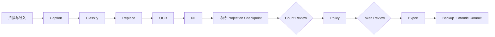

<div align="center">

# Tagger2 Inference Rebuild

**面向 Windows 的本地优先图像打标、视觉模型推理与数据集工作流工作台**

[](https://github.com/nzs234/Tagger2_Inference_Rebuild2/releases/latest) [](https://github.com/nzs234/Tagger2_Inference_Rebuild2/actions/workflows/ci.yml)    

[下载最新版](https://github.com/nzs234/Tagger2_Inference_Rebuild2/releases/latest) · [快速开始](#quick-start) · [数据集工作流](#dataset-workflow) · [开发与验证](#development) · [完整文档](#documentation)

</div>

---

Tagger2 Inference Rebuild 将本地 Caption 模型、在线视觉模型、多供应商图像生成、单图工作台、
批量任务、LSE14 美学评分、视频提示词和事务化数据集处理整合在一个 FastAPI + React 应用中。

项目以“本地数据默认留在本机”为基础：只有显式启用在线 Provider 或 NL 阶段时，才会向配置的远程服务发送请求。数据集工作流在真正写入文件前执行预检、人工复核、资源指纹校验和备份，尽量让大规模标注任务可检查、可恢复、可复现。

> [!IMPORTANT]
> 本仓库是独立重建版本，不会修改原项目。Dataset Workflow 的兼容性基线固定为
> [`lse14/e621-standard-capotion-workflow@ccc9d074`](https://github.com/lse14/e621-standard-capotion-workflow/commit/ccc9d07497be637fc097c5da009d791f017144c9)，严格端口文件由自动化测试校验。

<a id="contents"></a>

## 目录

- [项目特点](#highlights)
- [功能一览](#features)
- [快速开始](#quick-start)
- [模型与 Provider](#models-and-providers)
- [图像生成](#image-generation)
- [数据集工作流](#dataset-workflow)
- [输出格式](#output-format)
- [工作流资源](#workflow-resources)
- [配置与安全](#configuration-and-security)
- [更新项目](#updating)
- [开发与验证](#development)
- [构建发行包](#release-build)
- [目录结构](#project-layout)
- [常见问题](#troubleshooting)
- [相关文档](#documentation)

<a id="highlights"></a>

## 项目特点

| 能力 | 说明 |
| --- | --- |
| 本地优先 | 图片、模型、任务数据库和产物默认保存在本机；在线调用必须由用户显式配置。 |
| 本地与在线并行 | 工作台和批量任务均支持本地、在线以及本地 + 在线混合模式。 |
| 多供应商图像生成 | 在同一页面使用 Google Nano Banana、OpenAI GPT Image、xAI Grok Image 或兼容 API，并持久化任务与产物。 |
| 事务化工作流 | 数据集先导入到任务工作区，完成校验和人工复核后才进入 Export 与 Commit。 |
| 可复现审阅 | Caption、Classify、Replace、OCR、NL 只生成一次；审阅恢复读取带摘要的不可变 checkpoint。 |
| 原地更新保护 | `in_place` 模式在首次写入前创建并验证 ZIP64 标注备份，支持幂等恢复。 |
| 大任务恢复 | 样本按最多 500 条批量 claim，使用 lease、heartbeat 和 attempt 状态支持中断恢复。 |
| 固定资源 | 分类、替换、Tokenizer、OCR 等资源通过 manifest、大小和 SHA-256 指纹冻结。 |
| 安全边界 | API 使用 `root_id + relative_path`，Provider URL 执行 SSRF/DNS 校验并禁止自动重定向。 |
| 完整质量门禁 | 后端测试、Ruff、mypy、前端测试、ESLint、TypeScript、Vite 和 Playwright 由 CI 持续验证。 |

<a id="features"></a>

## 功能一览

应用启动后默认监听 [`http://127.0.0.1:20000`](http://127.0.0.1:20000)。左侧导航包含以下功能：

| 页面 | 主要用途 |
| --- | --- |
| 工作台 | 拖入单张或少量图片，独立启用本地和在线通道，查看标签、NL、JSON 与美学评分。 |
| 图像生成 | 统一使用 Grok、Nano Banana 与 GPT Image 系列，设置模型专属参数，管理参考图、进度、结果与历史。 |
| 视频提示词 | 根据图片和补充信息生成图生视频提示词，并管理提示词编辑结果。 |
| 批量任务 | 扫描本机目录，创建持久化的本地、在线或混合打标任务，查看进度和历史。 |
| 数据集工作流 | 执行 Caption、分类、标签替换、OCR、NL、人工复核、Policy、Token 检查与安全提交。 |
| 在线模型 | 管理 OpenAI、Gemini、Claude 和兼容 API，测试连接并发现可用模型。 |
| 本地模型 | 下载、注册、加载和卸载模型，管理推理后端、Adapter、阈值与显存驻留。 |
| 设置 | 管理输入/输出根目录、运行限制和非敏感运行配置。 |

支持的本地推理资产包括 ONNX、PyTorch 和 safetensors 模型。具体是否能自动识别，取决于模型目录内的权重、预处理配置和标签元数据是否完整。

<a id="quick-start"></a>

## 快速开始

### 方式一：使用发行包（推荐）

适合希望直接使用程序、不参与源码开发的用户。

1. 打开 [GitHub Releases](https://github.com/nzs234/Tagger2_Inference_Rebuild2/releases/latest)。
2. 下载最新的 `Tagger2_Inference_Rebuild_V*.zip` 和对应的 `.sha256.txt`。
3. 将 ZIP 完整解压到普通可写目录，不要直接在压缩包中运行。
4. 首次运行双击 `setup.bat`。
5. 等待便携 Python 和锁定依赖安装完成，浏览器访问 `http://127.0.0.1:20000`。
6. 以后启动只需双击 `start.bat`。

发行包内置基础 Python 3.12 运行时和已经构建的前端，不要求目标电脑预装 Python 或 Node.js。首次安装机器学习依赖需要联网，下载量可能达到数 GB。

V1.04.1 起，`setup.bat` 会检查 pip 是否真正可用，并在基础运行时中自动执行随包附带的 pip 引导；`start.bat` 也提供相同兜底。首次部署不需要手动安装 pip。

> [!TIP]
> `start.bat` 会通过 `nvidia-smi` 自动选择 CUDA 或 CPU 依赖。需要强制使用 CPU 时，可先在命令提示符中执行：
>
> ```bat
> set TAGGER2_TORCH_VARIANT=cpu
> setup.bat
> ```

### 方式二：从源码运行

适合开发者。需要 Git、Python 3.12 和 Node.js 22。

```powershell
git clone https://github.com/nzs234/Tagger2_Inference_Rebuild2.git
cd Tagger2_Inference_Rebuild2

py -3.12 -m venv .venv
.\.venv\Scripts\python.exe -m pip install --require-hashes -r requirements-gpu.lock
# CPU 机器将上一行的 requirements-gpu.lock 改为 requirements-cpu.lock

cd frontend
npm ci
npm run build
cd ..

$env:PYTHONPATH = "$PWD\backend"
.\.venv\Scripts\python.exe -m tagger2.main
```

### 完成第一个打标任务

1. 打开“本地模型”，下载或注册至少一个 Caption 模型。
2. 加载模型，并确认页面显示模型已驻留。
3. 回到“工作台”，拖入图片。
4. 启用“本地模型”，选择需要参与推理的模型。
5. 按模型预设使用阈值，或只为本次任务调整分类阈值。
6. 提交任务，结果会按本地与在线通道分别显示。

要处理完整数据集，请继续阅读[数据集工作流](#dataset-workflow)。

<a id="models-and-providers"></a>

## 模型与 Provider

### 本地模型

- 可在“本地模型”页面输入 Hugging Face 仓库地址下载模型。
- 也可以将已有模型完整复制到 `models/`，再刷新模型注册表。
- 模型 Profile 可保存后端类型、输入尺寸、全局阈值、分类阈值和 Adapter 配置。
- 默认最多同时驻留两个模型，可通过配置调整；显存不足时应主动卸载不用的模型。
- 首次加载 LSE14 美学评分器时，可能需要下载固定的 SigLIP、CLIP 与 `1k.safetensors` 资产。

LSE14 输出包括 1-5 分总体评分与分桶、构图、色彩、敏感内容评分和域内概率。模型缓存位于 `data_cache/huggingface`，权重位于 `models`；需要 Hugging Face 身份验证时，请通过进程环境变量 `HF_TOKEN` 提供令牌。

### 在线 Provider

界面内置以下连接预设：

- OpenAI 官方 API
- xAI / Grok 官方 API
- Gemini 官方 API
- Claude 官方 API
- OpenAI / NewAPI 兼容接口
- Gemini `generateContent` 兼容接口
- Claude Messages 兼容接口
- 兼容旧配置的 LM Studio 与 Antigravity Provider

API Key 不写入 TOML。Windows 默认通过 Credential Manager 对应的 keyring 后端保存；API 响应只暴露“是否已配置”和末尾字符等非敏感元数据。

> [!WARNING]
> 启用在线模型、NL 图片输入或远程兼容接口意味着图片或业务 JSON 可能被发送给相应 Provider。请先确认数据授权范围、服务条款和隐私要求。

<a id="image-generation"></a>

## 图像生成

V1.04 将原先独立图像工具的核心工作流重建为 Tagger2 原生页面。它复用“在线模型”中的 Provider、密钥存储与模型发现能力，但使用独立的持久任务数据库和产物目录。旧工具中的明文配置、历史记录和临时文件不会被自动读取或迁移。

### 支持的模型族与路由

| 模型族 | 自动识别示例 | 可用请求风格 | 主要参数 |
| --- | --- | --- | --- |
| Google Gemini / Nano Banana | `gemini-3-pro-image`、`gemini-3.1-flash-image`、`gemini-3.1-flash-lite-image`、`gemini-2.5-flash-image` | Gemini native `generateContent`；OpenAI-compatible chat/images | 比例、图像尺寸、参考图、TEXT + IMAGE、System instruction、Temperature、Top P、Top K、并行或 Candidate count |
| OpenAI GPT Image | 所有 `gpt-image*` 模型 ID | Images generations / edits；兼容 chat | 画布尺寸、质量、背景、输出格式、压缩、审核级别、输入保真度 |
| xAI Grok Image | `grok-2-image-1212`；其他 Grok 图像模型可显式选择能力族 | Images generations / edits；兼容 chat | 通用数量/响应格式；兼容线路可按能力启用比例、尺寸和质量 |
| 保守兼容模式 | 未登记的新模型或私有网关模型 | OpenAI images 或 chat | 默认只发送 `model`、`prompt`、`n` 和响应格式等通用字段 |

模型实际是否可用、账户是否有访问权限以及服务端允许的数量仍由 Provider 决定。能力注册表有版本和核验日期；未知模型不会自动收到供应商专属参数。若兼容网关明确支持某一模型族，可在 Provider 设置中显式选择能力族与请求风格。

Gemini 模型显式选择 OpenAI-compatible Chat/Images 风格时，会同时发送兼容工具常用的 `generation_config` 与 `extra_body.google` 图像扩展；native 风格只发送官方 `generationConfig.imageConfig`。这些扩展不会自动发送给未知模型或其他模型族。

### 配置 Provider

1. 打开“在线模型”，新建 OpenAI、xAI、Gemini 或“自定义 API” Provider。
2. 填写文本/通用 Base URL 和主模型；图像服务使用不同域名时，单独填写“图像 Base URL”。
3. 打开“启用图像生成”。自动识别不准确时，选择 Gemini / Nano Banana、GPT Image 或 Grok Image 能力族。
4. 请求风格选择“自动”，或按网关文档指定 Gemini native、Images generation/edit、Chat completions。
5. 保存后写入 API Key。密钥保存在系统 Credential Manager，不会进入任务 JSON、SQLite 公共字段或浏览器 URL。

### 创建与管理任务

1. 打开“图像生成”，选择 Provider 和模型；模型输入框会复用现有模型发现 API。
2. 选择文生图或图像编辑，填写提示词；编辑模式至少需要一张参考图。
3. 设置数量与当前模型公开的参数。高级区域只显示该能力族和请求风格支持的字段。
4. 提交后可离开页面。任务、attempt、事件、参考图副本和结果均已持久化，刷新页面仍可继续查看。
5. 失败、部分成功或取消的任务可重试；删除历史会同时删除对应参考图副本和生成产物，并要求二次确认。

多图的“并行请求”会按 Provider 并发上限运行独立 attempt；Gemini 支持时也可使用单次请求的 Candidate count。应用退出时，正在执行的 attempt 会回到可恢复状态；已完整写入并通过 SHA-256 校验的产物不会再次调用 Provider。

### 数据与安全边界

- 独立数据库：`data/image_generation/image_generation.sqlite3`
- 任务工作区：`data/image_generation/jobs/<job_id>/`
- 每个任务冻结非敏感 Provider 快照、能力快照和配置 hash；执行前必须再次核对摘要。
- 参考图和产物保存相对路径、尺寸、MIME 与 SHA-256；内容被修改后下载和恢复都会 fail closed。
- Provider JSON 响应、Base64 图像和远程图片下载均有字节/像素/边长上限，不依赖 `Content-Length` 才生效。
- Provider 与产物 URL 禁止自动重定向，并在配置和请求阶段执行 DNS/SSRF 检查。
- 局域网模式下，图片预览和下载同样通过 Bearer Token 请求，不把令牌写入图片 URL。

<a id="dataset-workflow"></a>

## 数据集工作流

Dataset Workflow 面向需要批量整理现有标注、生成标准九字段数据、进行人工复核并安全写回的数据集任务。



### 阶段说明

| 阶段 | 作用 | 默认行为 |
| --- | --- | --- |
| Scan / Import | 扫描图片和现有 TXT/JSON，识别裸图、标签 TXT、NL TXT、标准 JSON 与 raw e621 JSON。 | 始终执行 |
| Caption | 调用已加载的本地模型生成标签。 | 对需要补充标签的样本启用 |
| Classify | 使用冻结的 e621/Danbooru 快照，将标签整理到标准字段。 | e621 配置启用 |
| Replace | 按不可变索引执行 keep / replace / drop 规则。 | 使用 `replace-e621-pass-drop-v2` |
| OCR | 通过隔离的 PaddleOCR CPU 运行时识别画面文字。 | 可选，默认关闭 |
| NL | 复用原始 NL 或通过选定 Provider 生成自然语言描述。 | UI 中需显式配置远程生成 |
| Count Review | 对 `solo`、`duo`、`trio`、`group` 等数量结果进行人工确认。 | 可选 |
| Policy | 按稳定 seed 执行 artist/quality dropout 和 appearance/NL 联动策略。 | 默认关闭 |
| Token Budget | 使用冻结 Tokenizer 检查超长文本，并允许人工修改 NL。 | 可选阈值，资源随包提供 |
| Export / Commit | 生成 JSON、TXT 或两者，并在校验通过后写入目标数据集。 | 最终阶段 |

### 审阅结果不会被重新生成

在进入 Count Review 前，系统将 Caption、Classify、Replace、OCR 和 NL 的完整 projection 写入任务专属的不可变 checkpoint。checkpoint 包含：

- schema 版本与 stage cursor
- 任务配置 hash
- 资源与模型 fingerprints
- 样本 manifest
- projection 内容摘要 digest

Count Review 确认后只叠加人工 count，再执行 Policy；Token Review 确认后只叠加人工 NL 修改，再继续 Token Budget、Export 和 Commit。checkpoint 缺失、内容被修改、配置变化或资源指纹不一致时，任务会 fail closed，不会静默重新调用模型或远程 Provider。

### 写入模式

| 模式 | 行为 | 适用场景 |
| --- | --- | --- |
| `full_copy` | 将图片和新标注复制到独立输出目录，源数据保持不变。 | 首次使用、验证配置、保留原始数据 |
| `in_place` | 在原数据集旁更新标注；首次写入前生成并验证 ZIP64 备份。 | 已确认流程和结果的大规模更新 |

建议先用小样本和 `full_copy` 验证结果，再对正式数据使用 `in_place`。

### 生命周期与恢复

- 任务支持显式开始、暂停、恢复、取消、修复、恢复备份和丢弃。
- 执行进度、事件、issue、资源快照和 commit journal 持久化到独立 SQLite 数据库。
- worker 按最多 500 个样本领取 lease，并周期性 heartbeat；进程重启后可跳过已完成样本。
- Restore 请求具备幂等记录，重复请求不会再次覆盖用户后续修改。
- Discard 进入独立终态并释放数据集锁，不再暴露恢复操作。
- 事件同时支持带 cursor、heartbeat 与 `Last-Event-ID` 的 SSE，以及 JSON polling fallback。

<a id="output-format"></a>

## 输出格式

工作流最终 JSON 严格包含九个字段，并保持固定顺序：

| 字段 | 类型 | 含义 |
| --- | --- | --- |
| `quality` | `string[]` | 质量或评级标签 |
| `count` | `string` | `""`、`solo`、`duo`、`trio` 或 `group` |
| `character` | `string` | 角色名 |
| `series` | `string` | 系列或作品名 |
| `artist` | `string` | 作者名 |
| `appearance` | `string[]` | 外观特征 |
| `tags` | `string[]` | 通用标签 |
| `environment` | `string[]` | 环境与场景标签 |
| `nl` | `string` | 自然语言描述 |

```json
{
  "quality": ["high_quality"],
  "count": "solo",
  "character": "example_character",
  "series": "example_series",
  "artist": "example_artist",
  "appearance": ["blue_eyes", "long_hair"],
  "tags": ["looking_at_viewer", "smile"],
  "environment": ["outdoors", "forest"],
  "nl": "A character with long hair is smiling in a forest."
}
```

TXT 输出使用与固定上游兼容的 flat caption 规则：跨字段去重、下划线转空格、括号转义，并以句点结束。

<a id="workflow-resources"></a>

## 工作流资源

V1.04 发行包包含默认 e621 工作流所需的非模型资源：

| 类别 | Resource ID | SHA-256 / 状态 |
| --- | --- | --- |
| 分类快照 | `classify-e621-20260812-v1` | `eccfdfacf3bcf1611a9ee3561f54bb81e946122f582f1f421c5e90689f2db49f` |
| 推荐替换索引 | `replace-e621-pass-drop-v2` | `2e3c4af6cc93b7f2cc8e55e2eda024ee69942f08a3618b6c2f0dfe6d45991972` |
| Tokenizer | `tokenizer-qwen3-0-6b-tokenizer-v1` | `aeb13307a71acd8fe81861d94ad54ab689df773318809eed3cbe794b4492dae4` |

推荐替换索引统计：47,095 keep、3,171 replace、105,440 drop、0 pass。上游 `anthro` 到 `furry` 的随机规则保持原算法不变，调用方通过 `job_id + sample_id + relative_path` 注入任务内稳定随机值，保证同一任务恢复审阅时结果不漂移。

以下内容不会包含在 Git 仓库或基础发行包中：

- Caption 模型权重与 Adapter
- Hugging Face 模型缓存
- `runtime_ocr/` 和 PaddleOCR 模型缓存
- 用户图片、任务数据库、日志和任务产物
- API Key、访问 Token 和其他凭据

### 导入官方分类快照

```powershell
.\runtime\python.exe scripts\import_classification_snapshot.py `
  --profile e621 `
  --tags-csv C:\snapshots\e621\tags.csv.gz `
  --aliases-csv C:\snapshots\e621\tag_aliases.csv.gz `
  --implications-csv C:\snapshots\e621\tag_implications.csv.gz `
  --resource-id classify-e621-20260812-v1 `
  --source-url https://e621.net/db_export/ `
  --allow-official-anomalies `
  --anomaly-report C:\snapshots\e621\quarantine.json
```

`--allow-official-anomalies` 不会修复异常标签，只会隔离精确源行并记录数量；不使用该参数时 importer 保持严格并直接失败。

### 导入 Tokenizer 与 OCR

```powershell
# Qwen3 tokenizer.json，仅用于准确计数，不需要模型权重
.\runtime\python.exe scripts\import_tokenizer_resource.py `
  C:\snapshots\qwen3-0.6b\tokenizer.json `
  --source-url https://huggingface.co/Qwen/Qwen3-0.6B/resolve/main/tokenizer.json

# 独立 OCR Python 环境与本机资源描述
powershell -ExecutionPolicy Bypass -File .\scripts\setup_ocr_runtime.ps1
.\runtime_ocr\Scripts\python.exe scripts\import_ocr_runtime_resource.py
```

<a id="configuration-and-security"></a>

## 配置与安全

主配置文件为 `config/app.toml`，模板位于 `config/app.example.toml`。TOML 只保存非敏感运行参数；`TAGGER2_*` 环境变量优先于文件配置。

```toml
[server]
host = "127.0.0.1"
port = 20000
lan_access = false
access_token_env = "TAGGER2_ACCESS_TOKEN"
allow_local_providers = true # 允许 LM Studio 等本机服务；不需要时可关闭

[paths]
cache_dir = "data_cache"
data_dir = "data"
upload_dir = "data/uploads"
artifact_dir = "data/artifacts"
allowed_input_roots = []
allowed_output_roots = []

[runtime]
max_loaded_models = 2
gpu_concurrency = 1
allow_unsafe_pickle = false
```

### 重要安全约束

- 服务默认只绑定 `127.0.0.1`。
- 开放局域网访问必须同时设置 `lan_access = true` 和 `TAGGER2_ACCESS_TOKEN`。
- 文件 API 不接受或返回任意绝对路径，所有数据集路径都通过已注册 root 和相对路径解析。
- 输入和输出目录分别受 allowlist 管理，路径越界与符号链接逃逸会被拒绝。
- 除 LM Studio、Antigravity 等显式本地类型或 `allow_local_providers = true` 外，Provider URL 会拒绝 loopback、private、link-local、reserved 和 IPv6 本地地址。
- 十进制拼接、十六进制等含糊的数字化主机名始终会被拒绝。
- Provider 在配置阶段解析 A/AAAA，建立连接时再次校验目标地址，降低 DNS rebinding 风险。
- HTTP 客户端禁止自动跟随重定向，避免经由 redirect 绕过目标地址限制。
- `allow_unsafe_pickle` 默认为 `false`；不要加载来源不可信的 pickle 模型。
- 错误响应使用稳定错误码，不向客户端返回服务器绝对路径或原始系统异常文本。

> [!CAUTION]
> 分享项目目录前，请检查 `config`、`data`、`models`、`data_cache`、日志和 Windows Credential Manager。不要分享包含私人图片、任务数据库、访问令牌或 Provider 密钥的副本。

<a id="updating"></a>

## 更新项目

### Git 克隆版本

双击 `update.bat`，或执行：

```powershell
powershell -ExecutionPolicy Bypass -File .\scripts\update_from_git.ps1
```

更新器只会从 `origin/main` 执行 fast-forward，并在以下情况停止：

- 当前为 detached HEAD
- 存在未提交的受跟踪文件修改
- 本地与远端历史发生分叉
- 远端、分支或 Git 环境不可用

脚本不会执行 reset，也不会覆盖本地提交。更新成功后运行 `start.bat`，让依赖锁文件的变化生效；如果前端源码有变化，开发者还需要重新执行 `npm run build`。

### Release ZIP 版本

发行 ZIP 不包含 `.git` 元数据，不能通过 `update.bat` 原地同步。请下载新的 Release 并解压到新目录，确认以下本地内容已经迁移或重新配置后，再删除旧目录：

- `config/app.toml`
- `models/`
- `data_cache/`
- `data/`
- 独立 OCR 运行时与资源描述

<a id="development"></a>

## 开发与验证

### 后端

```powershell
$env:PYTHONPATH = "$PWD\backend"
.\.venv\Scripts\python.exe -m pytest backend\tests -q
.\.venv\Scripts\python.exe -m ruff check backend scripts
.\.venv\Scripts\python.exe -m mypy backend scripts
```

### 前端

```powershell
cd frontend
npm ci
npm test
npm run lint
npm run build
npm run test:e2e
```

### 本地模型 Smoke Test

```powershell
.\.venv\Scripts\python.exe scripts\smoke_workbench_local.py --device cuda
```

该测试只读验证单张图片在一个和两个本地模型下的推理，不创建正式任务或修改数据集。

### Benchmark

```powershell
.\.venv\Scripts\python.exe scripts\benchmark.py `
  --model SmilingWolf__wd-eva02-large-tagger-v3 `
  --images data\uploads `
  --device cuda `
  --batch-size 16 `
  --limit 100
```

### 依赖锁

部署使用的 `requirements-*.lock` 固定所有直接和传递依赖，并要求 SHA-256 hash。`requirements-*.txt` 是生成锁文件的源清单，不是发行部署输入。

```powershell
powershell -ExecutionPolicy Bypass -File .\scripts\compile_requirements.ps1
# 可加 -Target cpu、gpu 或 dev，只更新一个目标
```

<a id="release-build"></a>

## 构建发行包

```powershell
powershell -ExecutionPolicy Bypass -File .\scripts\build_release.ps1
```

发行脚本会：

1. 拒绝非 Git 工作区或存在未提交修改的源码。
2. 校验固定上游提交和严格端口 manifest。
3. 执行 workflow E2E、review checkpoint、前端 lint 与 build 门禁。
4. 复制后端、前端、脚本、锁文件和允许发布的不可变资源。
5. 扫描凭据并排除模型、缓存、数据库和用户数据。
6. 解压成品并执行健康检查。
7. 生成 `VERSION.txt`、`VALIDATION_REPORT.json`、ZIP 和 SHA256 文件。

CI 会从固定提交检出上游项目，并执行完整后端、前端和 Playwright 测试，避免本地缺少上游工作区时跳过端口一致性检查。

<a id="project-layout"></a>

## 目录结构

```text
Tagger2_Inference_Rebuild2/
├─ backend/tagger2/          FastAPI 服务、模型运行时、任务与安全模块
│  ├─ image_generation/      多供应商图像请求、能力表、持久任务与产物校验
│  └─ workflow/              数据集工作流、数据库、stage、review 与 commit
├─ backend/tests/            后端单元、集成、恢复、安全和规模测试
├─ frontend/src/             React 用户界面
├─ frontend/e2e/             Playwright 浏览器验收
├─ config/                   非敏感应用配置
├─ docs/                     工作流、兼容性与发行说明
├─ scripts/                  导入、验证、更新、benchmark 和发布脚本
├─ models/                   本地模型权重，不提交 Git
├─ data_cache/               Hugging Face 等模型缓存，不提交 Git
├─ data/                     数据库、上传、产物和工作流资源，不提交 Git
├─ runtime/                  便携 Python 运行时，按需准备
├─ runtime_ocr/              隔离 OCR 运行时，按需准备
├─ setup.bat                 首次安装
├─ start.bat                 日常启动
└─ update.bat                Git 安全更新
```

工作流使用独立数据库 `data/workflows/workflows.sqlite3`，不会迁移或改写主任务数据库。每个任务的配置、manifest、checkpoint、staging、issue、备份和 commit journal 都保存在独立 job workspace 中。

图像生成同样使用独立数据库和 `data/image_generation/jobs`，不会读取旧图像工具的明文 Provider 配置或历史文件。

<a id="troubleshooting"></a>

## 常见问题

<details>
<summary><strong>首次安装时间很长或下载失败</strong></summary>

机器学习运行时体积较大。请检查网络、代理、防火墙、磁盘空间和 Python 下载源，然后重新运行 `setup.bat`。依赖锁未变化时，脚本不会重复安装全部包。

</details>

<details>
<summary><strong>CUDA 无法使用</strong></summary>

先更新 NVIDIA 驱动并确认 `nvidia-smi` 可运行。仍无法启动时，使用 `set TAGGER2_TORCH_VARIANT=cpu` 强制安装 CPU 版本。CPU 可以运行，但大型模型速度会明显降低。

</details>

<details>
<summary><strong>浏览器打不开页面</strong></summary>

确认启动窗口仍在运行，并访问 `http://127.0.0.1:20000`。如果提示端口 20000 被占用，请关闭旧的 Tagger2 进程，或修改 `config/app.toml` 中的端口。

</details>

<details>
<summary><strong>图像生成页面没有显示某个参数</strong></summary>

页面按“模型能力族 + 请求风格”投影参数。先检查 Provider 的图像能力族、图像 Base URL 和请求风格；未知模型默认进入保守模式。只有确认兼容网关实现了对应字段后，才应显式选择完整能力族，避免上游因未知参数拒绝请求。

</details>

<details>
<summary><strong>Git 更新器拒绝更新</strong></summary>

先运行 `git status`。提交或暂存受跟踪文件修改，再确认当前分支没有与 `origin/main` 分叉。更新器有意拒绝 reset；需要保留本地开发分支时，请手动 merge 或 rebase。

</details>

<details>
<summary><strong>工作流显示资源不可用</strong></summary>

工作流不会在任务执行中猜测或自动替换资源。请检查资源 ID、manifest 和 fingerprint；OCR 还需要本机独立运行时与模型缓存。资源 drift 会在预检或恢复阶段阻止任务继续。

</details>

<details>
<summary><strong>Count/Token 复核后为什么任务没有直接写入</strong></summary>

任务只有在所有 blocking issue、人工复核、Token 检查、资源指纹和 staging 校验全部通过后才会 Commit。请查看任务的阶段报告、issue 列表和事件流定位仍未满足的门禁。

</details>

<a id="documentation"></a>

## 相关文档

- [中文使用说明](USER_GUIDE_zh-CN.txt)
- [Dataset Workflow 模块说明](docs/workflow_module.md)
- [Dataset Workflow 路径操作说明](docs/workflow_manual_paths.md)
- [固定上游兼容性报告](docs/workflow_compatibility_report.md)
- [发行包内容与资源指纹](docs/release_package_contents.md)
- [V1.04.1 部署修复说明](docs/V1.04.1_RELEASE_NOTES.md)
- [V1.04 图像生成功能说明](docs/V1.04_RELEASE_NOTES.md)
- [最新 Release](https://github.com/nzs234/Tagger2_Inference_Rebuild2/releases/latest)
- [提交问题](https://github.com/nzs234/Tagger2_Inference_Rebuild2/issues)

问题报告请尽量附带版本、`VERSION.txt` 中的 source commit、复现步骤、稳定错误码和已脱敏日志。不要在 Issue 中上传 API Key、访问 Token、私人图片、绝对数据路径或完整任务数据库。
